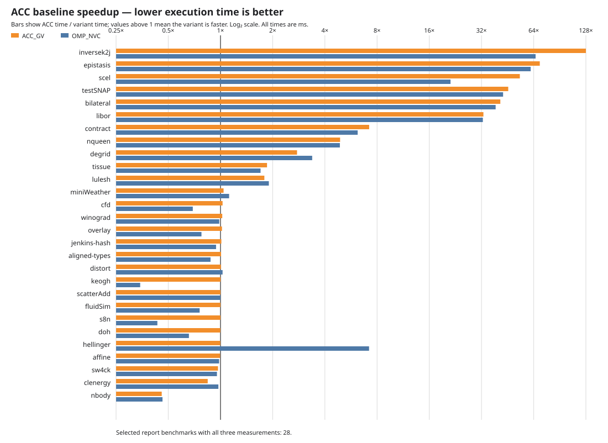

# OpenACC gang-vector variants

This directory contains the OpenACC variants used to evaluate the gang/vector
mapping recommended in the NVIDIA HeCBench ACC-versus-CUDA analysis.

## What changed

The original `*-acc` implementations were copied into matching `*-acc_gv`
directories.  In every `#pragma acc parallel loop`, the generator adds each
missing clause independently:

```c++
#pragma acc parallel loop gang vector
```

This targets the loss of parallelism that can occur when an OpenMP
`target teams distribute parallel for` is translated as a descriptive
`acc parallel loop`.  The report identifies `inversek2j`, `softmax`,
`epistasis`, and `testSNAP` as representative cases.

## Generation

Run from `src3` with either benchmark names or a newline-delimited list:

```bash
./scripts/acc2acc_gv.sh inversek2j softmax
./scripts/acc2acc_gv.sh ./scripts/bench_names
```

The script copies `<benchmark>-acc` to `<benchmark>-acc_gv` and rewrites only
C/C++ source and header files.  It prints `Generated: N/M` at completion.
Existing `*-acc_gv` directories are replaced, so regenerate before retaining
manual changes.

## Measurements

`acc.csv`, `acc_gv.csv`, and `omp_nvc.csv` contain the benchmark timings used
below.  `autohecbench.py` normalizes the matched time unit to **milliseconds**.
The inputs and regular expressions come from `scripts/benchmarks/subset.json`.
Only measurements taken with the same GPU, compiler version, runtime settings,
and benchmark arguments are comparable.

### External LFS datasets

The following five ACC_GV benchmarks require an input archive that is
intentionally not included in this branch: GitHub refused its upload because
the upstream repository's Git LFS quota is exhausted.  The archives remain
available in the local working tree used for the measurements; obtain or
provision them locally before running the corresponding benchmark on a fresh
clone.

```text
bfs-acc_gv       src3/data/bfs/graph1MW_6.txt.tar.bz
cfd-acc_gv       src3/data/cfd/cfd.tar.bz
hotspot3D-acc_gv src3/data/hotspot3D/hotspot3D.tar.bz
kmeans-acc_gv    src3/data/kmeans/kdd_cup.tar.bz
nn-acc_gv        src3/data/nn/nn.tar.bz
```

The chart is intentionally sorted by ACC → ACC_GV speedup, so the major changes
appear first.  It shows `ACC time / variant time`: a value above `1×` means the
variant is faster than the original ACC version.



| Benchmark | ACC (ms) | ACC_GV (ms) | OMP_NVC (ms) | ACC → ACC_GV | ACC → OMP_NVC |
|---|---:|---:|---:|---:|---:|
| inversek2j | 0.84084 | 0.00657 | 0.01281 | 128.00× | 65.63× |
| epistasis | 1519.9 | 21.908 | 24.718 | 69.38× | 61.49× |
| scel | 42.705 | 0.80182 | 2.0124 | 53.26× | 21.22× |
| testSNAP | 631.59 | 13.838 | 14.810 | 45.64× | 42.65× |
| bilateral | 202.98 | 4.9379 | 5.2569 | 41.11× | 38.61× |
| libor | 107.78 | 3.2830 | 3.3080 | 32.83× | 32.58× |
| contract | 1408.3 | 195.62 | 227.86 | 7.20× | 6.18× |
| nqueen | 214.74 | 43.852 | 44.002 | 4.90× | 4.88× |
| degrid | 109.42 | 39.600 | 32.373 | 2.76× | 3.38× |
| tissue | 13.827 | 7.4530 | 8.1220 | 1.86× | 1.70× |
| lulesh | 3080.0 | 1720.0 | 1620.0 | 1.79× | 1.90× |
| miniWeather | 1428.9 | 1371.3 | 1274.2 | 1.04× | 1.12× |
| cfd | 304.93 | 296.51 | 440.48 | 1.03× | 0.69× |
| winograd | 85.672 | 83.689 | 87.045 | 1.02× | 0.98× |
| overlay | 3551.1 | 3481.0 | 4571.8 | 1.02× | 0.78× |
| jenkins-hash | 2.2680 | 2.2420 | 2.4050 | 1.01× | 0.94× |
| aligned-types | 1.4859 | 1.4737 | 1.6956 | 1.01× | 0.88× |
| distort | 0.02072 | 0.02060 | 0.02016 | 1.01× | 1.03× |
| keogh | 50.794 | 50.701 | 147.50 | 1.00× | 0.34× |
| scatterAdd | 33.093 | 33.092 | 33.087 | 1.00× | 1.00× |
| fluidSim | 0.02200 | 0.02200 | 0.02900 | 1.00× | 0.76× |
| s8n | 16.198 | 16.199 | 37.460 | 1.00× | 0.43× |
| doh | 0.01381 | 0.01383 | 0.02100 | 1.00× | 0.66× |
| affine | 0.01061 | 0.01067 | 0.01081 | 0.99× | 0.98× |
| sw4ck | 257.58 | 266.22 | 270.04 | 0.97× | 0.95× |
| clenergy | 0.71156 | 0.84270 | 0.73145 | 0.84× | 0.97× |
