# ベンチマークが標準出力に出力する値

| 名称 | cuda | sycl | acc | omp  | 単位 | 分類 | グラフ |
|  ---: | ---:  | ---: | ---: | ---: | ---:   | ---:   | ---: |
| accuracy | 6.02e+02 | 6.07e+02 | 6.85e+02 | 8.27e+02 | us | A |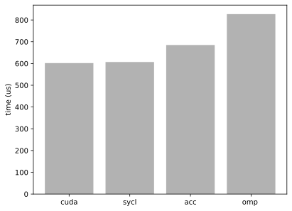 |
| ace | 2.35e+03 | 2.64e+03 | 2.52e+03 | 2.52e+03 | ms | A |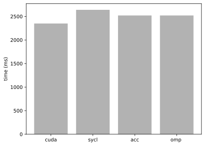 |
| adam | 6.02e-02 | 6.23e-02 | 7.61e-02 | 1.06e-01 | ms | A |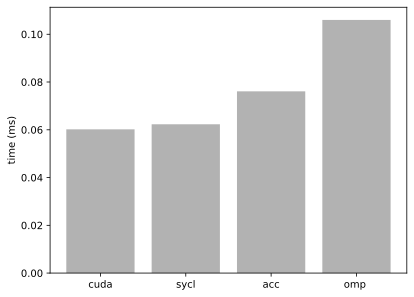 |
| adamw | 5.17e-02 | 5.42e-02 | 9.97e-02 | 6.95e-01 | ms | A |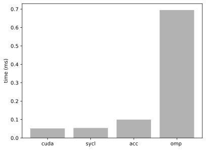 |
| adjacent | 2.40e+03 | 2.41e+03 | 3.04e+03 | 6.03e+03 | us | A |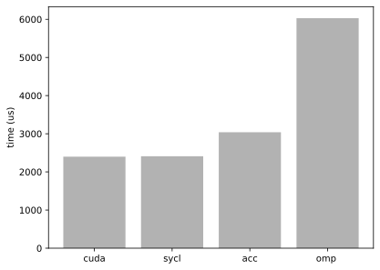 |
| adv | 3.82e+06 | 5.34e+06 | | 6.92e+06 | ns | B |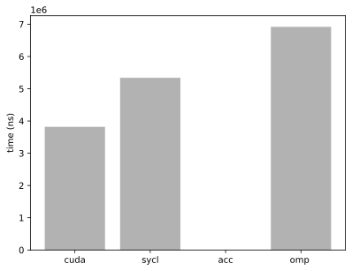 |
| aes | 3.14e-04 | 2.98e-04 | | 4.23e-04 | s | B |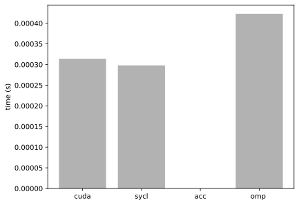 |
| affine | 3.13e-06 | 2.95e-06 | 1.03e-05 | 9.82e-06 | s | A |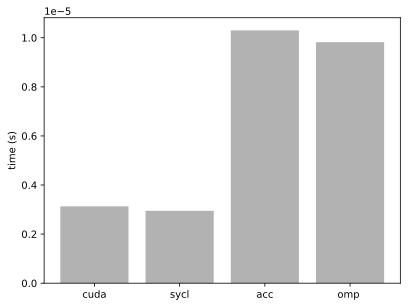 |
| aidw | 7.70e-03 | 4.73e-02 | 1.95e-02 | 9.10e-03 | s | B |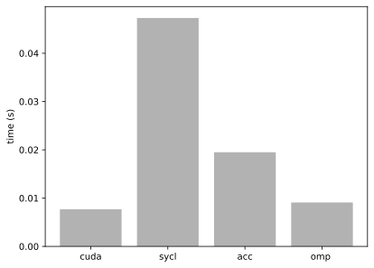 |
| aligned-types | 6.29e-01 | 7.25e-01 | 1.47e+00 | 1.69e+00 | ms | A |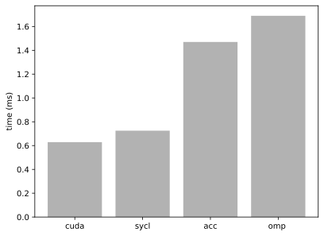 |
| all-pairs-distance | 2.12e+02 | 2.54e+02 | 2.15e+02 | 1.87e+03 | us | B |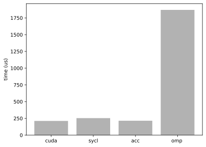 |
| amgmk | 2.45e+00 | 2.37e+00 | 2.35e+00 | 2.38e+00 | s | B |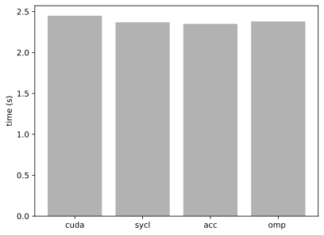 |
| ans | 5.14e+00 | 5.40e+00 | | | s | A |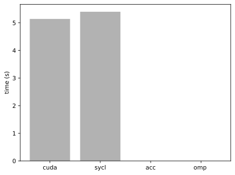 |
| aobench | 8.90e+01 | 1.02e+02 | 7.87e+01 | 1.06e+02 | us | A |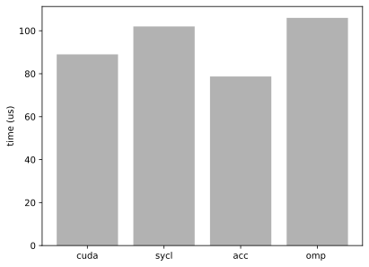 |
| aop | 4.00e+00 | 4.01e+00 | | | ms | B |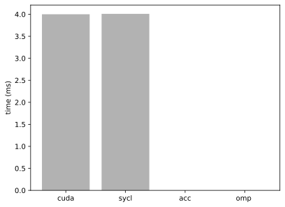 |
| asmooth | 5.16e-03 | 5.68e-03 | 5.65e-03 | 5.80e-03 | s | A |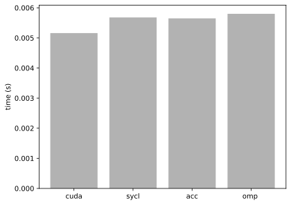 |
| assert | 2.43e+00 | 3.34e-02 | | 5.02e+00 | ns | B |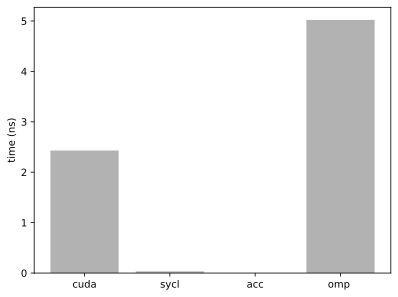 |
| asta | 1.53e-02 | | | 7.29e-02 | s | B |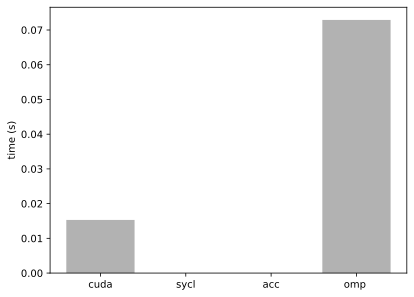 |
| atan2 | 1.38e+02 | 1.41e+02 | 1.70e+02 | 1.89e+02 | us | A |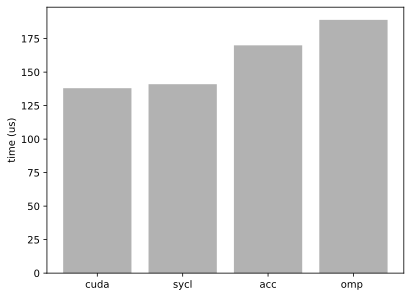 |
| atomicCost | 1.09e+04 | 1.08e+04 | 1.15e+04 | 1.42e+04 | us | A |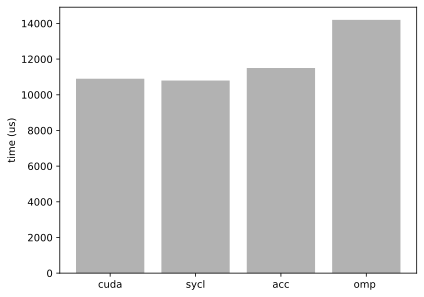 |
| atomicIntrinsics | 4.23e+05 | | 3.12e+04 | 3.38e+04 | us | A |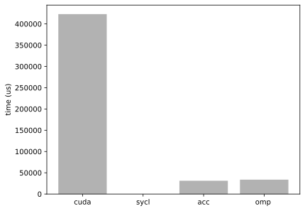 |
| atomicPerf | 6.61e+03 | 6.62e+03 | 6.69e+03 | 7.20e+03 | us | B |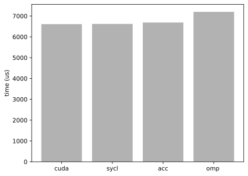 |
| atomicReduction | 5.12e+04 | 5.11e+04 | 4.55e+04 | 4.59e+04 | GB/s | A |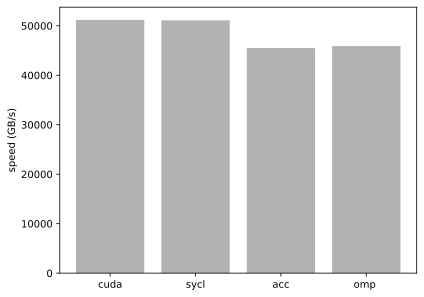 |
| attention | 4.31e-01 | 4.31e-01 | 4.31e-01 | 9.30e-01 | ms | A |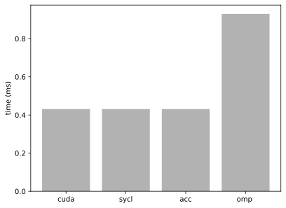 |
| axhelm | 2.22e+07 | 2.18e+07 | | 2.18e+07 | ns | B |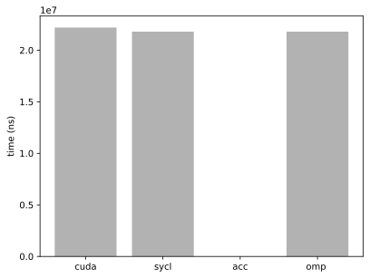 |
| babelstream | 6.69e+06 | 6.68e+06 | 6.59e+06 | 6.04e+06 | s | A |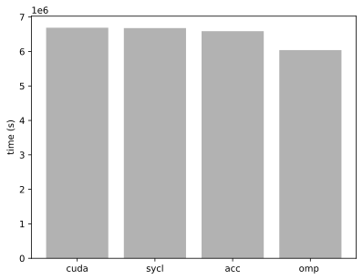 |
| background-subtract | 1.03e+02 | 1.06e+02 | 1.14e+02 | 1.63e+02 | us | A |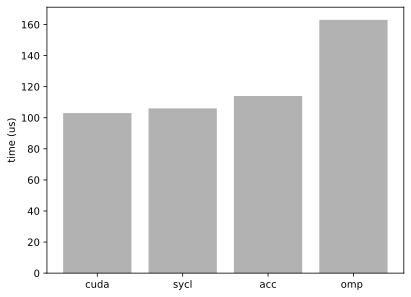 |
| backprop | 2.45e+00 | 2.34e+00 | 2.35e+00 | 2.39e+00 | s | B |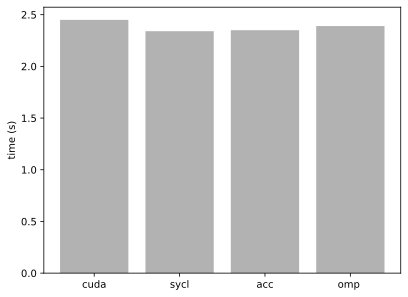 |
| bezier-surface | 8.80e+01 | 1.13e+02 | 3.18e+03 | 9.70e+01 | ms | A |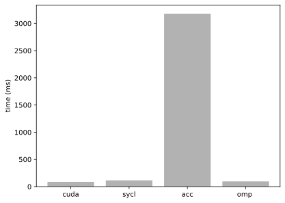 |
| bfs | 3.84e+02 | 5.30e+02 | 4.43e+02 | 1.27e+03 | us | A |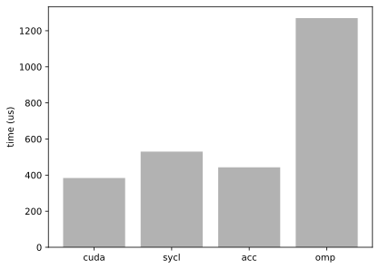 |
| bilateral | 4.86e+00 | 4.90e+00 | 2.03e+02 | 5.22e+00 | ms | A |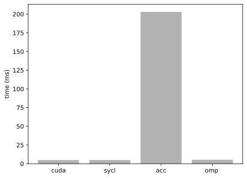 |
| binomial | 2.99e+03 | 2.77e+03 | | | ms | B |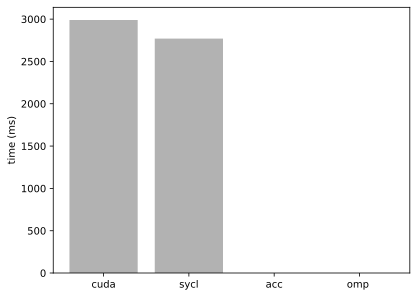 |
| bitonic-sort | 3.29e+01 | 3.28e+01 | 3.72e+01 | 5.55e+01 | ms | A |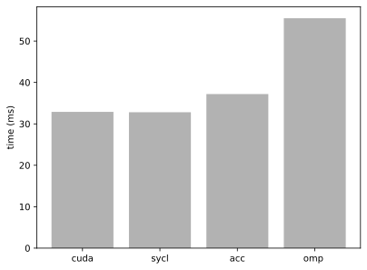 |
| black-scholes | 2.08e+03 | 2.25e+03 | 1.93e+03 | 2.25e+03 | ms | A |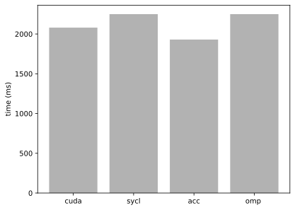 |
| blas-gemm | 5.06e+03 | | | | us | A |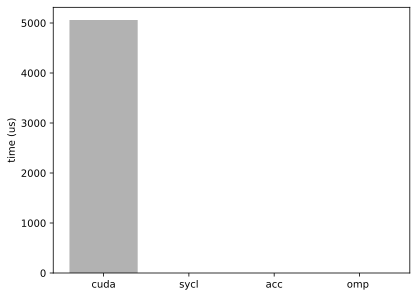 |
| bn | 1.62e-01 | 2.21e-01 | | | s | B |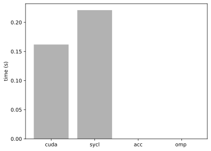 |
| bonds | 3.76e+01 | 2.21e+01 | 5.24e+01 | 5.05e+01 | ms | A |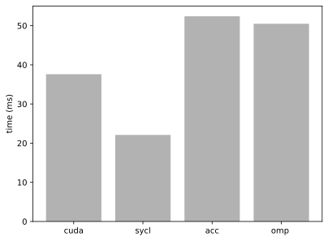 |
| boxfilter | 6.43e+02 | 5.68e+02 | 3.96e+02 | 7.06e+02 | us | B |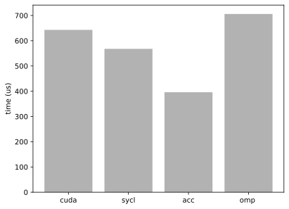 |
| bsearch | 3.12e+00 | 2.30e+00 | 2.73e-01 | 2.27e-01 | s | B |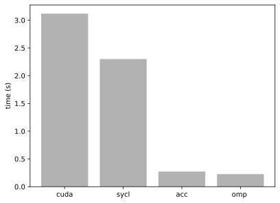 |
| bspline-vgh | 1.32e-01 | 1.65e-01 | 1.40e-01 | 1.43e-01 | s | A |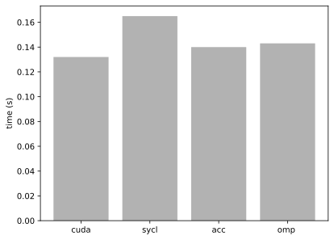 |
| b+tree | 2.06e+02 | 3.28e+02 | 1.64e+03 | 1.39e+03 | us | A |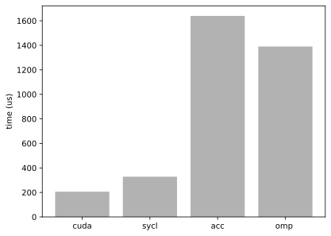 |
| burger | 5.62e-01 | 5.18e-01 | 6.35e-01 | 5.78e-01 | s | A | |
| bwt | 1.58e+04 | 1.53e+04 | 1.20e+03 | | ms | A |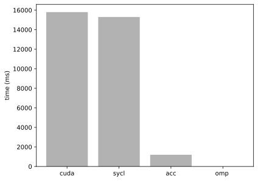 |
| car | 4.84e-03 | 4.54e-03 | 5.59e-03 | 5.65e-03 | s | A |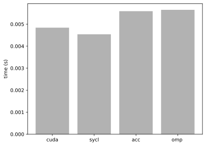 |
| cbsfil | 3.66e-02 | 3.43e-02 | 5.26e-02 | 3.64e-02 | s | A |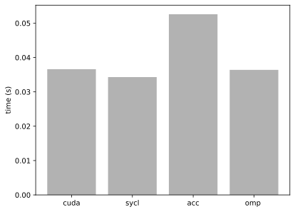 |
| ccsd-trpdrv | 4.20e-05 | 4.60e-05 | 4.80e-05 | 8.70e-05 | s | A |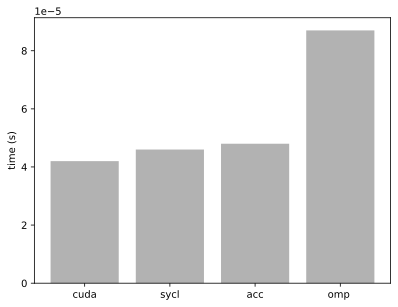 |
| ccs | 1.09e-02 | 1.17e-02 | 8.89e-03 | 1.31e-02 | s | B |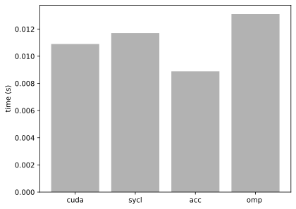 |
| cfd | 8.72e-02 | 7.91e-02 | 3.00e-01 | 4.22e-01 | s | A |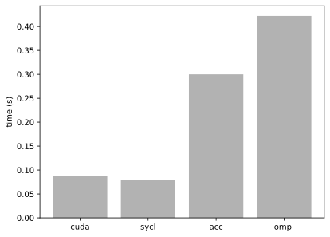 |
| chacha20 | 2.25e+01 | 2.24e+01 | 6.79e+01 | 4.18e+01 | us | B |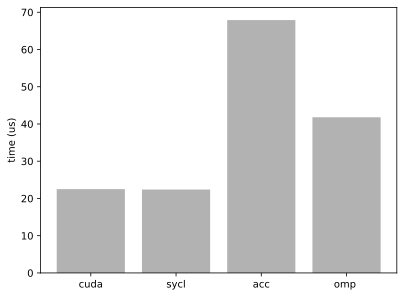 |
| channelShuffle | 2.40e+01 | 2.43e+01 | 3.85e+01 | 3.83e+01 | ms | A |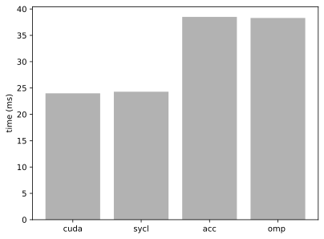 |
| channelSum | 6.26e+01 | 6.28e+01 | 5.93e+01 | 8.76e+01 | ms | A |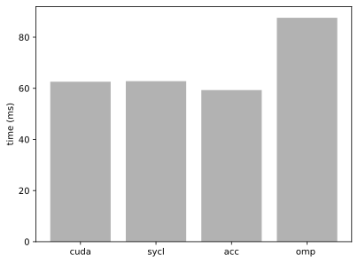 |
| chemv | | 6.82e+02 | 3.52e+02 | 7.67e+02 | us | B | |
| che | 7.66e-01 | 6.10e-01 | 9.72e-01 | 9.08e-01 | s | A | |
| chi2 | | 1.47e-02 | 1.40e-02 | 1.40e-02 | s | A | |
| clenergy | 2.10e-01 | 2.23e-01 | 7.11e-01 | 7.32e-01 | s | A | |
| clink | 3.20e+01 | 3.58e+01 | 4.97e+01 | 4.28e+01 | ms | A | |
| cmp | | | | |  | A | |
| cm | | | | |  | B | |
| cobahh | 4.61e+04 | 3.44e+04 | 4.96e+04 | 1.40e+04 | us | A | |
| colorwheel | 1.25e+02 | 1.24e+02 | 1.23e+02 | 1.22e+02 | ms | A | |
| columnarSolver | 7.30e+00 | 7.76e+00 | 1.46e+01 | 7.75e+00 | s | B | |
| complex | 1.02e-02 | 1.04e-02 | 1.01e-02 | 1.04e-02 | s | A | |
| compute-score | 6.12e-01 | 6.14e-01 | 7.00e-01 | 1.79e+00 | ms | B | |
| concat | 2.98e+03 | 2.97e+03 | 3.06e+03 | 3.67e+03 | us | A | |
| contract | 6.65e+00 | 8.82e+00 | 2.64e+01 | 8.29e+00 | s | A | |
| conversion | 1.74e-01 | 1.69e-01 | 9.22e-02 | 7.96e-02 | , | A | |
| convolution1D | 1.42e+05 | 1.72e+05 | 3.12e+05 | 1.58e+06 | us | B | |
| convolution3D | 3.16e+01 | 3.48e+01 | 1.22e+03 | 2.76e+01 | us | A | |
| convolutionSeparable | 2.30e-03 | 2.30e-03 | | 1.13e-02 | s | B | |
| cooling | 5.13e+02 | 3.97e+02 | 4.19e+02 | 3.80e+02 | ms | A | |
| crc64 | 4.77e+04 | 5.14e+04 | 5.58e+04 | 5.60e+04 | MB/s | A | |
| cross | 6.96e+03 | 6.96e+03 | 7.01e+03 | 7.00e+03 | us | A | |
| crs | 6.64e-02 | 7.19e-02 | | | s | B | |
| d2q9-bgk | 5.83e+00 | 5.49e+00 | | 2.45e+01 | us | B | |
| damage | 1.89e-02 | 1.99e-02 | 3.22e-02 | 2.39e-01 | s | B | |
| dct8x8 | 9.43e-03 | 9.43e-03 | | | s | B | |
| ddbp | 3.42e-01 | | | 2.63e-01 | s | B | |
| debayer | 3.62e-03 | 3.69e-03 | 7.15e-02 | 8.39e-02 | s | B | |
| degrid | 1.29e-02 | 1.28e-02 | 1.01e-01 | 3.28e-02 | s | A | |
| dense-embedding | 2.37e+04 | 2.36e+04 | 2.35e+04 | 3.88e+04 | us | B | |
| depixel | 1.01e+02 | 1.53e+02 | 2.05e+02 | 1.63e+02 | s | A | |
| deredundancy | 1.62e+01 | 1.55e+01 | 1.56e+01 | 1.57e+01 | s | B | |
| diamond | 3.67e+01 | 1.61e+01 | | 3.72e+01 | s | A | |
| distort | 1.24e-02 | 7.77e-03 | 2.09e-02 | 1.97e-02 | ms | A | |
| divergence | 1.09e+03 | 1.35e+03 | 3.34e+02 | 3.39e+02 | ms | A | |
| doh | 6.92e+00 | 7.73e+00 | 1.38e+01 | 2.32e+01 | us | A | |
| dp | 2.11e+01 | | 2.02e+01 | 2.04e+01 | ms | A | |
| dslash | 4.09e-02 | 5.13e-02 | 6.16e-02 | 6.45e-02 | s | A | |
| dxtc2 | 3.16e+02 | 3.62e+02 | | | us | B | |
| easyWave | 2.14e+04 | 2.13e+04 | 1.98e+04 | 2.07e+04 | ms | A | |
| ecdh | 1.19e-01 | 8.15e-02 | 1.50e-01 | 1.64e-01 | s | A | |
| eigenvalue | 2.04e+01 | 2.43e+01 | | 2.34e+01 | us | A | |
| entropy | 4.86e-02 | 5.30e-02 | 5.17e-01 | 7.12e-02 | s | B | |
| epistasis | 2.01e-02 | 1.99e-02 | 1.52e+00 | 2.47e-02 | s | A | |
| expdist | 3.32e-03 | 3.29e-03 | | 8.57e-03 | s | B | |
| extend2 | 2.60e+03 | 1.14e+03 | 2.02e+03 | 2.18e+03 | us | A | |
| extrema | 2.54e-01 | 3.09e-01 | 9.41e-02 | 1.09e-01 | s | A | |
| face | 2.64e+00 | 2.55e+00 | 2.38e+00 | 2.11e-01 | s | A | |
| fdtd3d | 4.69e-04 | 3.92e-04 | | 4.78e-03 | s | B | |
| feynman-kac | 7.87e+00 | 3.94e+00 | 4.57e+00 | 1.98e+00 | s | A | |
| fft | 3.55e-04 | 6.13e-04 | | 1.15e-03 | s | B | |
| fhd | | 1.79e+02 | | | s | A | |
| filter | 6.17e+00 | | | 7.69e+01 | ms | B | |
| flip | 4.12e+01 | 4.72e+01 | 6.36e+01 | 7.60e+01 | ms | A | |
| floydwarshall | 2.02e-01 | 2.08e-01 | 2.39e-01 | 3.47e-01 | s | A | |
| fluidSim | 1.20e-05 | 8.00e-06 | 2.20e-05 | 2.90e-05 | s | A | |
| fpc | 1.19e-02 | 1.23e-02 | | | s | B | |
| fpdc | 6.77e-04 | 6.42e-04 | | | s | B | |
| fresnel | 3.13e-03 | 1.48e-03 | 8.26e-03 | 8.23e-03 | s | A | |
| frna | 7.78e+01 | 8.04e+01 | | | s | B | |
| fwt | 4.81e-04 | 4.88e-04 | 7.90e-04 | 1.56e-03 | s | B | |
| gabor | 7.95e+03 | 8.18e+03 | 1.01e+04 | 1.11e+04 | us | A | |
| gamma-correction | 5.21e-04 | 6.09e-04 | 4.97e-04 | 1.79e-03 | s | A | |
| ga | 2.36e+00 | 2.82e+00 | 2.85e+00 | 2.68e+00 | s | A | |
| gaussian | 4.61e+05 | 3.92e+05 | 3.77e+05 | 3.82e+05 | us | A | |
| gc | 6.20e-05 | | | | s | A | |
| gd | 3.99e-01 | 5.12e-01 | 5.31e-01 | 7.87e-01 | s | A | |
| geglu | 7.58e+03 | 1.83e+04 | 1.97e+04 | 2.02e+04 | us | A | |
| geodesic | 2.89e+02 | 2.60e+02 | 2.86e+02 | 2.96e+02 | us | A | |
| glu | 1.86e+04 | 1.52e+04 | 1.90e+04 | 2.06e+04 | us | A | |
| gmm | 3.26e+00 | 3.23e+00 | | 4.23e+00 | s | B | |
| goulash | 1.25e+00 | 1.25e+00 | 1.26e+00 | 1.75e+00 | s | A | |
| gpp | 2.42e-01 | 1.84e-01 | 1.67e-01 | 1.72e-01 | s | A | |
| grep | | | | |  | B | |
| grrt | 1.01e+01 | 1.05e+01 | 9.26e+00 | 8.74e+00 | s | A | |
| haccmk | 2.15e-03 | 1.91e-03 | 4.60e-05 | 1.94e-03 | s | A | |
| hausdorff | 6.49e+00 | 6.76e+00 | 1.01e+01 | 7.26e+00 | ms | A | |
| haversine | 2.09e-04 | 2.35e-04 | | | s | A | |
| heartwall | 7.42e+00 | | | | s | A | |
| heat2d | 1.22e+03 | 1.18e+03 | 7.75e+02 | 6.89e+02 | GFLOPS | A | |
| heat | 2.29e+01 | 2.22e+01 | 1.53e+01 | 1.61e+01 | s | A | |
| hellinger | 2.87e-03 | 1.62e-03 | 2.72e-02 | 3.79e-03 | s | A | |
| henry | 1.25e-03 | 1.14e-03 | 4.65e-04 | 4.28e-04 | s | A | |
| hexciton | 1.38e+00 | 3.28e+00 | | 2.13e+00 | s | B | |
| histogram | 3.32e+02 | 3.02e+02 | | 7.93e+02 | us  | B | |
| hmm | 1.39e-01 | 1.44e-01 | 2.83e-01 | 1.90e-01 | s | A | |
| hogbom | 2.60e-01 | 1.40e-01 | 1.60e-01 | 3.10e-01 | ms | B | |
| hotspot3D | 7.44e+00 | 7.35e+00 | 1.72e+01 | 1.66e+01 | us | A | |
| hwt1d | 6.11e-04 | 6.20e-04 | 6.19e-04 | 7.06e-04 | s | B | |
| hybridsort | 2.22e+02 | 5.79e+01 | | 2.25e+02 | ms | B | |
| hypterm | 2.30e+00 | 2.62e+00 | 2.39e+00 | 2.42e+00 | ms | A | |
| idivide | 1.08e-02 | 4.31e-03 | 7.45e-03 | 1.82e-02 | s | A | |
| interleave | 1.47e-02 | 1.47e-02 | 1.40e-02 | 7.96e-03 | s | A | |
| interval | 4.33e+01 | 3.88e+01 | 1.02e+02 | 7.41e+01 | us | A | |
| inversek2j | 2.71e+00 | 3.12e+00 | 8.41e+02 | 1.11e+03 | us | A | |
| ising | 3.09e-01 | 3.50e-01 | 3.89e-01 | 4.86e-01 | s | A | |
| iso2dfd | 2.40e+01 | 2.45e+01 | 2.24e+01 | 3.20e+01 | ms | A | |
| jacobi | 2.74e+00 | 2.73e+00 | 3.57e+00 | 3.44e+00 | s | A | |
| jenkins-hash | 3.10e-03 | 3.56e-03 | 2.30e-01 | 2.28e-01 | s | A | |
| kalman | 3.22e-01 | | | | s | A | |
| keccaktreehash | 2.91e+07 | 3.08e+07 | 7.36e+05 | 2.86e+07 | kB/s | A | |
| keogh | 4.56e-03 | 5.04e-03 | 5.09e-02 | 1.52e-01 | s | A | |
| kernelLaunch | 1.83e+00 | 2.02e+00 | 1.13e+02 | 1.24e+01 | us | B | |
| kmeans | 2.79e+04 | 2.86e+04 | 2.66e+04 | 2.21e+04 | ms | A | |
| knn | 6.45e-01 | 4.71e-01 | 5.76e-01 | 7.78e-01 | s | B | |
| lanczos | 3.14e-01 | 3.11e-01 | | 4.95e-01 | s | B | |
| langevin | 6.30e-03 | 6.19e-03 | 6.31e-03 | 9.40e-03 | s | A | |
| langford | 1.24e-01 | 1.21e-01 | | | s | B | |
| laplace3d | 1.01e-02 | 1.03e-02 | 1.80e-02 | 1.95e-02 | s | A | |
| laplace | 1.16e+00 | 8.32e+00 | 4.92e+00 | 4.61e+00 | s | A | |
| lavaMD | 4.99e+00 | 5.82e+00 | | 1.82e+01 | s | B | |
| layout | 1.33e+02 | 1.41e+02 | 8.98e+01 | 8.85e+01 | us | A | |
| lci | 1.53e+01 | 7.50e+00 | 4.32e+00 | 4.28e+00 | s | A | |
| lda | 6.31e-03 | 6.53e-03 | | | s | B | |
| ldpc | 1.19e+00 | 1.27e+00 | | 5.92e+00 | s | B | |
| lebesgue | 2.66e+00 | 1.79e-01 | 2.43e+00 | 2.47e+00 | s | A | |
| leukocyte | 5.89e-01 | | | 8.64e-01 | s | A | |
| libor | 2.99e-03 | 3.20e-03 | 1.07e-01 | 3.30e-03 | s | A | |
| lid-driven-cavity | 7.56e+00 | 8.23e+00 | | 1.98e+01 | s | B | |
| lif | 1.37e+04 | 1.27e+04 | 1.70e+04 | 1.09e+04 | us | A | |
| linearprobing | 1.76e-03 | 1.77e-03 | | | s | A | |
| log2 | 2.02e+03 | 1.84e+03 | 2.41e+03 | 2.68e+03 | us | A | |
| lombscargle | 3.05e+02 | 1.80e+02 | 1.95e+02 | 2.17e+02 | us | A | |
| loopback | 3.26e-02 | 2.90e-02 | 2.98e-02 | 5.74e-02 | s | B | |
| lrn | 4.28e-01 | 6.49e-01 | 5.27e-01 | 6.42e-01 | s | A | |
| lr | 7.56e+00 | 7.50e+00 | 2.55e+01 | 5.51e+01 | us | B | |
| lsqt | 1.30e+01 | 1.29e+01 | 1.77e+01 | 1.74e+01 | s | A | |
| lud | 5.07e+00 | 5.72e+00 | 7.02e+00 | 4.36e+01 | s | B | |
| lulesh | 4.59e+00 | 5.66e+00 | 8.51e+00 | 5.18e+00 | s | A | |
| mallocFree | 2.53e+06 | 3.10e+03 | 2.34e+06 | 5.09e+02 | us | A | |
| mandelbrot | 5.78e-02 | 6.43e-02 | 5.90e-02 | 6.16e-02 | ms | A | |
| mask | 2.79e+04 | 2.76e+04 | 2.74e+04 | 2.78e+04 | us | A | |
| match | 2.38e+02 | 2.51e+02 | | 3.57e+11 | ms | B | |
| matern | 1.81e+04 | 1.92e+04 | 6.98e+03 | 1.45e+05 | us | B | |
| matrix-rotate | 7.03e-02 | 7.02e-02 | 7.13e-02 | 6.75e-02 | s | A | |
| maxFlops | 4.61e+00 | 4.62e+00 | 4.80e+00 | 4.59e+00 | s | A | |
| maxpool3d | 3.94e-03 | 4.14e-03 | 5.74e-03 | 6.76e-03 | s | A | |
| mcmd | 1.23e+01 | 9.01e+00 | 1.07e+01 | 1.10e+01 | s | A | |
| mcpr | 2.93e-02 | 5.56e-03 | 1.28e-01 | 2.83e-02 | s | B | |
| md5hash | 1.44e+04 | 1.40e+04 | 1.44e+04 | 1.45e+04 | ms | A | |
| mdh | 1.34e+00 | 5.90e-01 | 3.17e-01 | 1.23e+00 | s | A | |
| md | 6.56e-05 | 6.63e-05 | 7.48e-05 | 7.23e-05 | s | A | |
| meanshift | 4.41e-01 | 8.78e-01 | 1.37e+00 | 9.38e-01 | ms | B | |
| medianfilter | 7.60e-05 | 7.60e-05 | 8.50e-05 | 2.40e-04 | s | B | |
| memcpy | 1.82e+02 | 2.01e+02 | 2.48e+02 | 2.49e+02 | us | A | |
| memtest | 3.25e-02 | 3.46e-02 | 4.32e-02 | 4.31e-02 | s | A | |
| merge | 6.73e+04 | 6.65e+04 | | 1.62e+05 | us | B | |
| metropolis | 9.72e+00 | 1.11e+01 | | 6.14e+01 | s | B | |
| michalewicz | 1.09e+05 | 1.05e+06 | 1.45e+05 | 1.90e+05 | us | A | |
| minibude | 7.66e+02 | 9.10e+02 | 8.43e+02 | 1.25e+03 | ms | B | |
| miniFE | | | | |  | A | |
| minimap2 | 4.20e-02 | 5.79e-03 | 1.13e-02 | 1.09e-01 | s | A | |
| minisweep | 5.03e+01 | 5.41e+01 | 3.37e+01 | 3.34e+01 | s | A | |
| miniWeather | 6.96e-01 | 3.90e+00 | 2.99e+01 | 2.99e+01 | s | A | |
| minkowski | 2.31e-03 | 2.65e-03 | 2.22e-03 | 2.20e-03 | s | A | |
| mis | 2.17e-04 | 1.08e-04 | 0.00e+00 | 0.00e+00 | s | B | |
| mixbench | 6.06e-01 | 5.55e-01 | 6.31e-01 | 6.67e-01 | s | B | |
| morphology | 2.23e-01 | 2.24e-01 | | | s | B | |
| mrc | 1.38e+04 | 1.38e+04 | 1.39e+04 | 1.41e+04 | us | A | |
| mriQ | 2.60e+00 | 3.24e+00 | 3.29e+00 | 3.30e+00 | s | A | |
| mr | 2.25e+00 | 1.12e+00 | | 2.30e+00 | ms | A | |
| mt | 2.95e-03 | 1.88e-03 | 1.67e-03 | 1.68e-03 | s | A | |
| multimaterial | 1.14e+02 | 2.49e+00 | 3.14e+00 | 4.37e+00 | ms | A | |
| murmurhash3 | 3.97e-03 | 3.88e-03 | 3.99e-03 | 3.91e-03 | s | A | |
| myocyte | 1.49e+01 | | 3.22e+00 | 4.00e+00 | s | A | |
| nbody | 3.54e-02 | 3.33e-02 | 2.31e+00 | 2.40e+00 |  | A | |
| ne | 9.06e-04 | 1.18e-03 | 1.33e-03 | 1.61e-03 | s | A | |
| nlll | 8.41e+01 | 9.40e+01 | 1.33e+04 | 1.00e+02 | us | B | |
| nms | 7.40e-05 | 1.36e-04 | | 2.18e-04 | s | B | |
| nn | 2.43e+00 | 2.58e+00 | 7.74e+00 | 8.28e+00 | us | A | |
| norm2 | 2.05e+03 | | 2.91e+03 | 1.59e+04 | us | A | |
| nqueen | 3.85e-02 | 4.50e-02 | 2.14e-01 | 4.39e-02 | s | A | |
| ntt | 3.62e+01 | 4.14e+01 | | 4.19e+01 | us | B | |
| nw | 4.97e-02 | 4.95e-02 | | 1.23e-01 | s | B | |
| openmp | 2.55e+00 | 9.59e-02 | 2.44e+00 | 2.29e-01 | s | B | |
| overlay | 5.51e-01 | 5.91e-01 | 3.45e+00 | 4.89e+00 | s | A | |
| p4 | 8.25e+01 | 8.53e+01 | | 1.39e+03 | us | B | |
| page-rank | 3.93e+00 | 3.83e+00 | 4.08e+00 | 4.36e+00 | s | A | |
| particle-diffusion | 2.20e-03 | 1.69e-03 | 2.27e-03 | 2.27e-03 | s | A | |
| particlefilter | 2.22e+02 | 1.98e+02 | | 2.20e+02 | s | B | |
| particles | 1.07e+00 | 9.65e-01 | | | s | B | |
| pathfinder | 3.88e+01 | 3.88e+01 | 4.35e+01 | 7.99e+02 | s | B | |
| permutate | 2.05e+00 | 2.42e+00 | | 2.26e+00 | s | B | |
| permute | 2.00e+01 | 2.22e+01 | 2.23e+01 | 2.28e+01 | ms | A | |
| perplexity | 1.64e+00 | 2.24e+00 | 1.53e+00 | 1.69e+00 | s | A | |
| phmm | 1.16e+03 | 1.06e+03 | 4.63e+03 | 5.23e+03 | ms | B | |
| pnpoly | 4.59e-02 | 5.18e-02 | | 7.17e-01 | s | A | |
| pns | 5.44e+00 | 5.48e+00 | | | s | B | |
| pointwise | 9.21e-02 | 1.13e-01 | 1.84e-01 | 1.66e-01 | s | A | |
| pool | 8.88e-03 | 9.02e-03 | 1.83e-02 | 1.57e-02 | s | A | |
| popcount | 1.71e+05 | 8.28e+04 | 2.00e+05 | 7.06e+04 | us | A | |
| present | 3.81e+01 | 4.82e+01 | 3.69e+01 | 9.36e+01 | us | A | |
| prna | | | | |  | B | |
| projectile | 1.13e-04 | 1.13e-04 | 1.18e-04 | 1.19e-04 | s | A | |
| pso | 2.55e+01 | 2.42e+01 | 2.48e+01 | 2.19e+01 | us | A | |
| qrg | 4.48e+01 | 3.69e+01 | 5.94e+01 | 7.56e+01 | us | A | |
| qtclustering | 3.31e+01 | 3.20e+01 | | | s | B | |
| quantBnB | 6.09e+03 | 6.66e+03 | 2.74e+03 | 3.26e+03 | us | A | |
| quicksort | 6.92e+03 | 6.93e+03 | | 2.53e+03 | ms | B | |
| radixsort | 5.06e-04 | 5.17e-04 | | 5.71e-03 | s | B | |
| rainflow | 1.71e+05 | 1.49e+05 | 1.69e+05 | 1.27e+05 | us | A | |
| randomAccess | 1.58e-01 | 1.58e-01 | | 1.92e+00 | s | A | |
| reaction | 1.63e+00 | 1.64e+00 | | 6.75e+00 | s | B | |
| recursiveGaussian | 1.32e-03 | 1.49e-03 | | 1.67e-03 | s | B | |
| resize | 6.98e+02 | 7.58e+02 | 7.14e+02 | 8.35e+02 | us | A | |
| reverse | 9.29e-01 | 1.21e+00 | 4.23e+00 | 5.49e+00 | s | B | |
| rfs | 8.78e-03 | 8.78e-03 | 8.79e-03 | 8.79e-03 | s | A | |
| rng-wallace | 1.25e+02 | 1.18e+02 | | 1.12e+03 | us | B | |
| rodrigues | 3.10e+04 | 3.50e+04 | 3.49e+04 | 2.01e+04 | us | A | |
| romberg | 2.85e-04 | 2.91e-04 | 3.50e-04 | 3.26e-04 | s | B | |
| rsbench | 2.94e+00 | 3.35e+00 | 9.65e+00 | 2.91e+00 | s | A | |
| rsc | 1.55e+02 | 1.43e+02 | 2.17e+02 | 2.28e+02 | ms | B | |
| rtm8 | 1.02e-03 | 1.06e-03 | 8.59e-04 | 8.90e-04 | s | A | |
| rushlarsen | 2.29e-01 | 3.24e-01 | 2.32e-01 | 2.45e-01 | s | A | |
| s3d | 2.86e+00 | 4.81e-01 | | 2.84e+00 | s | A | |
| s8n | 1.16e+01 | 1.33e+01 | 3.26e+01 | 5.00e+01 | us | A | |
| sad | 4.00e+01 | 4.30e+01 | 4.84e+02 | 8.18e+04 | ms | A | |
| sampling | 2.39e+02 | 2.82e+02 | 3.71e+02 | 5.63e+02 | us | B | |
| scan2 | 3.55e+02 | 4.18e+02 | | 4.32e+03 | us | B | |
| scan | 1.75e+04 | 1.76e+04 | | 2.05e+05 | us | B | |
| scatterAdd | 3.91e+03 | 4.84e+03 | 1.60e+05 | 1.61e+05 | us | A | |
| scel | 2.92e+03 | 2.92e+03 | 4.27e+04 | 6.24e+03 | us | A | |
| secp256k1 | 2.91e-03 | 2.77e-03 | 2.92e-03 | 2.87e-03 | s | A | |
| sheath | 3.18e+00 | 3.44e+00 | 3.38e+00 | 3.40e+00 | ms | A | |
| shmembench | 2.70e+00 | 6.74e+00 | | | ms | B | |
| simplemoc | 1.76e+02 | 3.42e+02 | 2.35e+02 | 2.35e+02 | s | B | |
| simpleSpmv | 4.46e+01 | 3.58e+01 | 2.28e+01 | 4.70e+01 | ms | A | |
| slu | | | | | ms | B | |
| snake | 4.39e+03 | 4.85e+03 | 7.15e+03 | 7.15e+03 | us | A | |
| sobel | 4.80e+00 | 4.68e+00 | 1.01e+01 | 1.11e+01 | us | A | |
| sobol | 1.22e-03 | 1.28e-03 | | 3.35e-03 | s | B | |
| softmax-online | 1.44e+01 | 1.45e+01 | | 2.92e+01 | ms | B | |
| softmax | 1.12e+01 | 1.12e+01 | 3.43e+03 | 5.39e+01 | ms | A | |
| sort | 2.13e-02 | | | 3.44e-01 | s | B | |
| sosfil | 2.02e-02 | 2.29e-02 | 3.16e-02 | 1.05e-01 | s | B | |
| sph | 5.81e+00 | 5.85e+00 | 4.01e+01 | 5.91e+00 | ms | A | |
| split | 1.27e+04 | 1.28e+04 | | 1.49e+05 | us | B | |
| spm | 7.59e+01 | 6.59e+01 | 6.34e+01 | 7.27e+01 | ms | A | |
| sptrsv | 1.18e+02 | 1.37e+02 | | 1.17e+02 | us | B | |
| srad | 3.67e+01 | 3.74e+01 | | | s | B | |
| ss | 2.49e+02 | 2.36e+02 | 3.80e+02 | 7.90e+02 | us | B | |
| stddev | 3.77e-03 | 5.04e-03 | 5.56e-03 | 6.51e-02 | s | B | |
| stencil1d | 2.25e-03 | 2.25e-03 | 2.57e-01 | 3.50e-01 | s | A | |
| stencil3d | 6.27e-03 | 6.31e-03 | 6.40e-03 | 1.74e-02 | s | B | |
| streamcluster | 5.84e+00 | 5.00e+00 | 9.61e+00 | 7.69e+00 | s | B | |
| su3 | 1.92e+00 | 2.32e+00 | 2.34e+00 | 2.35e+00 | s | A | |
| surfel | 2.55e+02 | 2.59e+02 | 3.07e+02 | 3.59e+02 | ms | A | |
| svd3x3 | 4.60e+01 | 4.88e+01 | 6.86e+01 | 7.09e+01 | us | A | |
| sw4ck | 8.78e+00 | 1.02e+01 | 2.38e+02 | 2.36e+02 | ms | A | |
| swish | 4.13e+03 | 4.34e+03 | 4.59e+03 | 6.21e+03 | us | A | |
| tensorT | 1.41e+00 | 1.28e+00 | 1.36e+00 | 4.44e+00 | ms | B | |
| testSNAP | 1.11e+01 | 1.16e+01 | 6.34e+02 | 1.48e+01 | ms | A | |
| thomas | 1.44e+04 | 1.45e+04 | 1.26e+04 | 1.24e+04 | ms | A | |
| threadfence | 2.30e+02 | 2.34e+02 | 1.50e+02 | 3.27e+02 | ms | B | |
| tissue | 7.68e-03 | 8.00e-03 | 1.07e-02 | 8.15e-03 | s | A | |
| tonemapping | 1.69e+01 | 1.62e+01 | 1.91e+01 | 1.82e+01 | us | A | |
| tqs | 1.31e+02 | 8.24e+01 | | 1.42e+02 | ms | B | |
| triad | 1.86e+03 | 1.25e+03 | 5.74e+02 | 6.10e+02 | GFLOPS | A | |
| tridiagonal | 3.83e-02 | 3.82e-02 | | 1.55e-01 | s | B | |
| tsa | 1.71e+04 | 1.76e+04 | | 1.70e+05 | us | B | |
| tsp | 2.52e-02 | 5.34e-02 | | | s | B | |
| urng | 4.87e+00 | 4.99e+00 | 1.17e+01 | 2.37e+01 | us | B | |
| vanGenuchten | 7.29e-03 | 7.25e-03 | 7.44e-03 | 7.55e-03 | s | A | |
| vmc | 2.52e-03 | 1.89e-03 | | | s | B | |
| vol2col | 2.53e+03 | 2.55e+03 | 2.02e+03 | 2.73e+03 | us | A | |
| wedford | 3.87e+00 | 3.99e+00 | | 1.65e+01 | ms | B | |
| winograd | 7.85e-01 | 2.93e-01 | 3.18e+00 | 3.14e+00 | s | A | |
| wlcpow | 2.03e+03 | 2.09e+03 | | 6.74e+03 | us | B | |
| wordcount | 1.74e-03 | 3.75e-03 | 1.51e-03 | 2.73e-03 | s | A | |
| wsm5 | 2.98e+02 | 2.32e+02 | 3.10e+02 | 3.28e+02 | ms | B | |
| wyllie | 2.93e+01 | 2.96e+01 | 3.08e+01 | | ms | B | |
| xlqc | 2.01e+06 | | | 3.03e+05 | us | B | |
| xsbench | 4.45e+01 | 3.64e+01 | 3.59e+01 | 2.39e+00 | s | A | |
| zeropoint | 1.39e+04 | 1.51e+04 | 1.72e+04 | 2.01e+04 | us | A | |
| zmddft | 1.16e+00 | 1.40e+00 | | 2.01e+00 | ms | B | |

※ 分類: OpenMP コードが (omp_get_wtime 以外の) omp_get_* を (A) 含まない (B) 含む

※ メモリ: cuda 版での値
