# 実行時間 (秒)

| 名称 | cuda | sycl | acc | omp_nvc | 分類 | メモリ(GB) | plot |
| -- | -- | -- | -- | -- | -- | -- | -- |
| accuracy | 2.54 | 2.49 | 2.48 | 2.53 | A | 0.9 |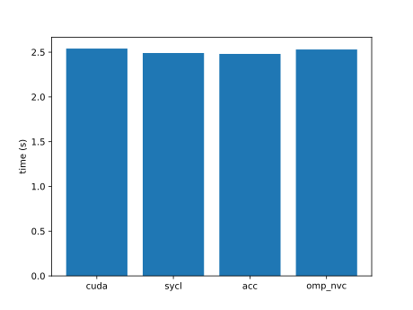 |
| ace | 2.90 | 3.13 | 2.84 | 2.79 | A | 4.0 |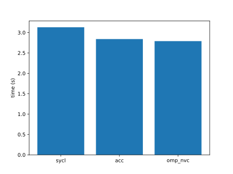 |
| adam | 5.20 | 5.24 | 6.72 | 6.70 | A | 0.6 |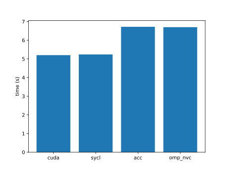 |
| adamw | 13.20 | 12.32 | 20.30 | 20.34 | A | 0.6 |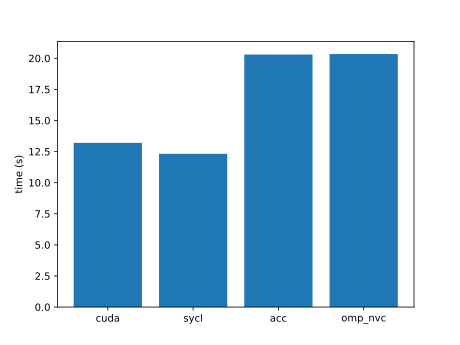 |
| adjacent | 7.66 | 9.13 | 7.03 | 15.22 | A | 4.5 |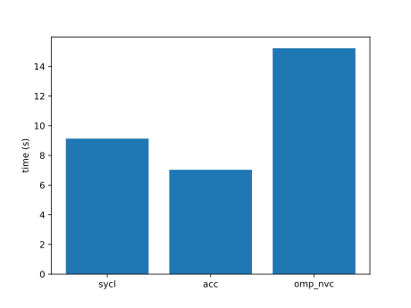 |
| adv | 3.05 | 3.35 | build err | 3.49 | B | 4.9 |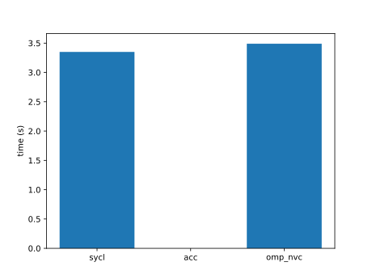 |
| aes | 2.72 | 2.79 | build err | 2.70 | B | 0.6 | |
| affine | 5.62 | 5.42 | 12.78 | 12.37 | A | 0.6 |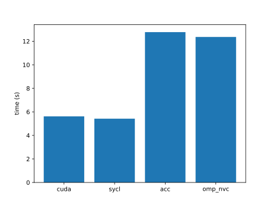 |
| aidw | 4.58 | 12.87 | 5.42 | 6.21 | B | 0.6 |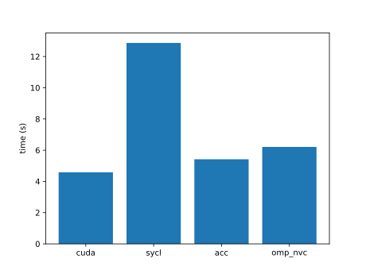 |
| aligned-types | 3.82 | 3.68 | 4.40 | 4.71 | A | 0.7 |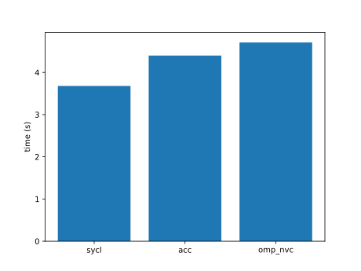 |
| all-pairs-distance | 4.96 | 5.23 | 4.81 | 21.34 | B | 0.6 |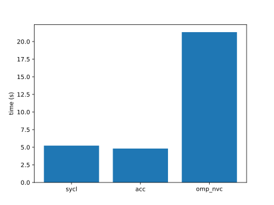 |
| amgmk | 2.51 | 2.45 | 2.42 | 2.44 | B | 0.6 |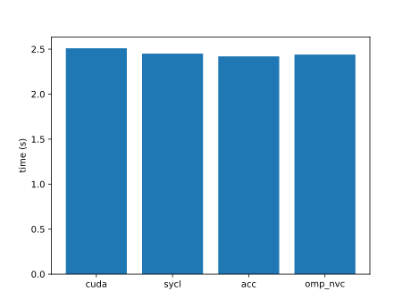 |
| ans | 5.19 | 5.42 | exe err | exe err | A | 0.6 | |
| aobench | 2.46 | 0.36 | 2.42 | 2.47 | A | 0.6 |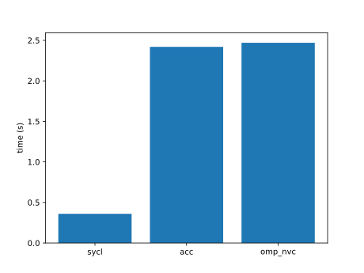 |
| aop | 7.03 | 7.02 | build err | build err | B | 0.6 |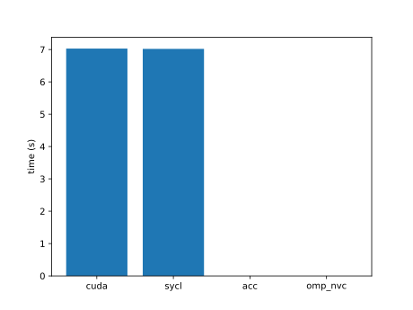 |
| asmooth | 12.47 | 5.70 | 7.38 | 7.33 | A | 1.6 |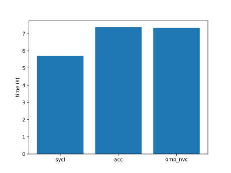 |
| assert | 2.51 | exe err | build err | 2.58 | B | 0.6 | |
| asta | 4.36 | build err | build err | 10.71 | B | 0.6 |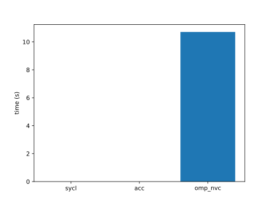 |
| atan2 | 2.68 | 3.24 | 2.52 | 2.54 | A | 0.7 |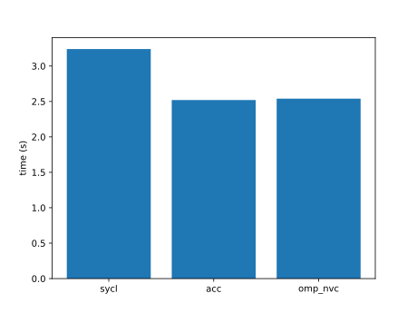 |
| atomicCost | 16.01 | 18.89 | 18.84 | 5.36 | A | 14.6 |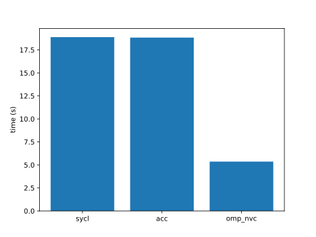 |
| atomicIntrinsics | 3.90 | over 600 | 3.18 | 3.21 | A | 0.6 |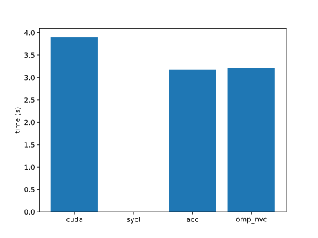 |
| atomicPerf | 14.33 | 14.66 | 13.47 | 13.88 | B | 0.6 |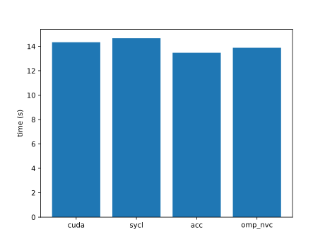 |
| atomicReduction | 2.70 | 3.44 | 2.65 | 2.63 | A | 0.8 |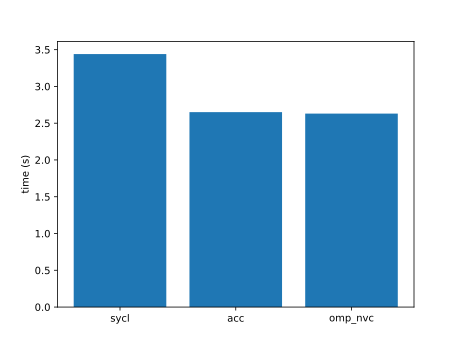 |
| attention | 2.48 | 2.47 | 83.27 | 83.85 | A | 1.1 |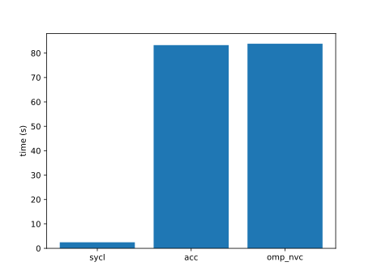 |
| axhelm | 2.46 | 2.41 | build err | 2.47 | B | 0.7 |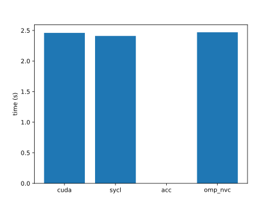 |
| babelstream | 2.74 | 0.56 | 2.72 | 2.85 | A | 1.3 |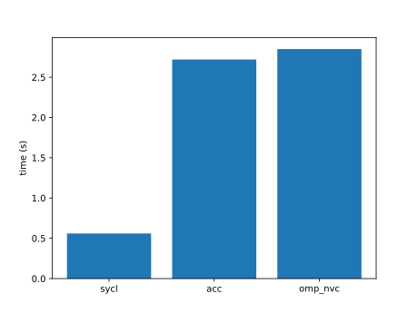 |
| background-subtract | 6.52 | 8.07 | 8.66 | 8.33 | A | 0.6 |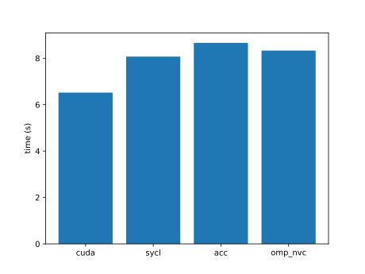 |
| backprop | 2.53 | 2.45 | 2.44 | 2.47 | B | 0.6 |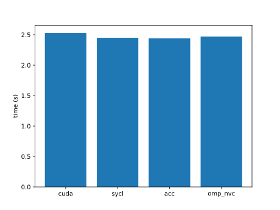 |
| bezier-surface | 12.43 | 12.93 | 14.25 | 10.71 | A | 1.3 |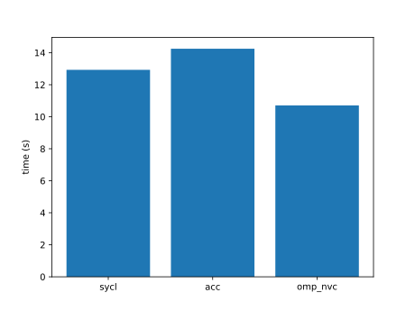 |
| bfs | 0.98 | 1.03 | 2.48 | 2.46 | A | 0.6 |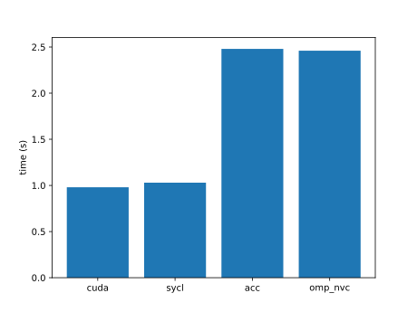 |
| bilateral | 7.64 | 15.09 | 205.59 | 7.85 | A | 0.6 |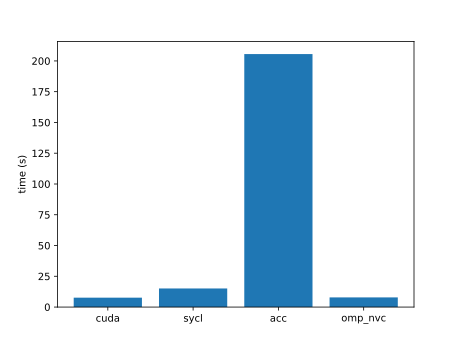 |
| binomial | 3.24 | 3.10 | | -- | B | 0.6 | |
| bitonic-sort | 13.52 | 10.81 | 7.80 | 8.49 | A | 0.7 | |
| black-scholes | 4.80 | 5.00 | 39.24 | 4.88 | A | 2.5 |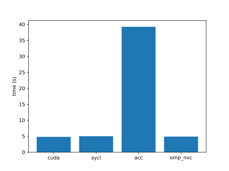 |
| blas-gemm | 5.70 | build err | | -- | A | 1.1 | |
| bn | 4.47 | 5.00 | build err | exe err | B | 0.6 | |
| bonds | 11.93 | 7.66 | 11.50 | 11.19 | A | 0.8 |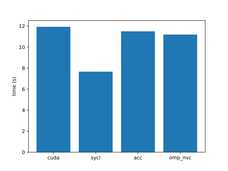 |
| boxfilter | 9.06 | 8.46 | 6.47 | 9.55 | B | 0.6 |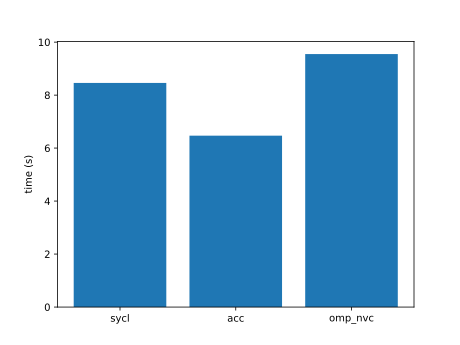 |
| bsearch | 33.96 | 34.85 | 32.68 | 31.84 | B | 27.3 |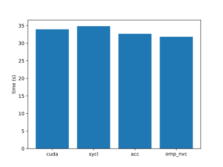 |
| bspline-vgh | 9.73 | 7.74 | 4.73 | 4.81 | A | 2.6 |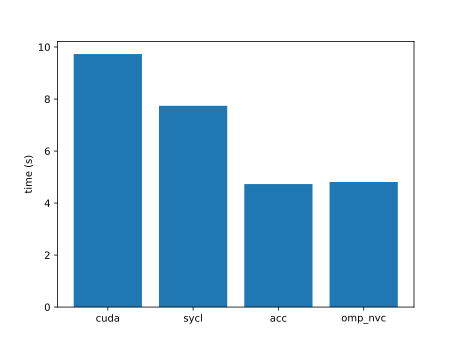 |
| b+tree | 2.87 | 2.46 | 2.46 | 2.46 | A | 0.6 |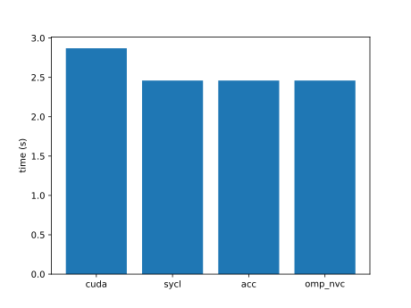 |
| burger | 84.00 | 72.44 | 68.61 | 112.53 | A | 8.4 |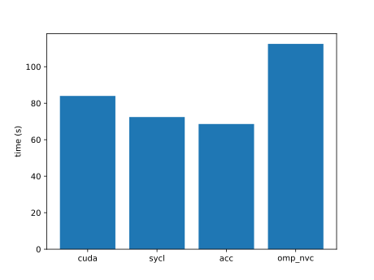 |
| bwt | 204.75 | 199.29 | 188.93 | exe err | A | 1.3 |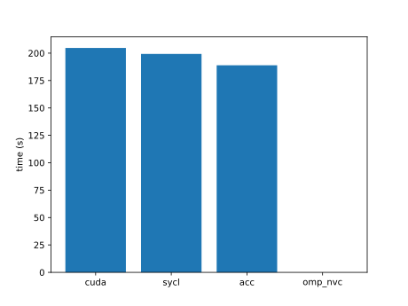 |
| car | 7.41 | 7.18 | 6.64 | 6.65 | A | 6.6 | |
| cbsfil | 32.08 | 31.48 | 35.01 | 33.19 | A | 2.4 |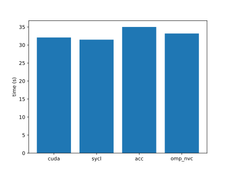 |
| ccsd-trpdrv | 2.61 | 2.67 | 2.55 | 2.63 | A | 0.6 |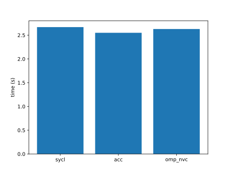 |
| ccs | 3.36 | 3.57 | 2.97 | 3.65 | B | 0.6 |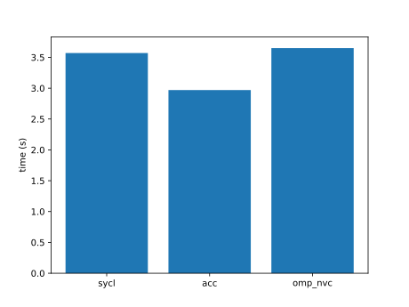 |
| cfd | 0.82 | 0.58 | 3.02 | 3.08 | A | 0.6 |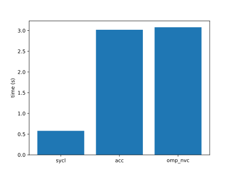 |
| chacha20 | 4.74 | 4.68 | 9.24 | 6.66 | B | 0.6 |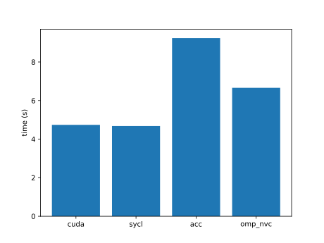 |
| channelShuffle | 18.46 | 538.46 | 19.23 | 19.24 | A | 13.1 |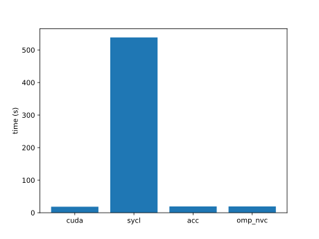 |
| channelSum | 65.58 | 64.97 | 65.55 | 68.17 | A | 6.8 |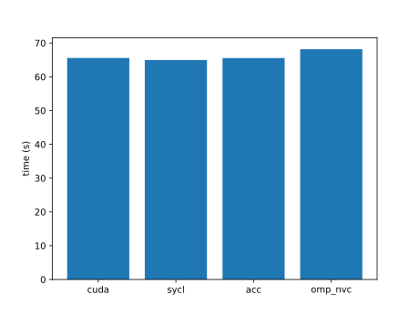 |
| chemv | 3.21 | 3.20 | 2.85 | 3.21 | B | 0.6 |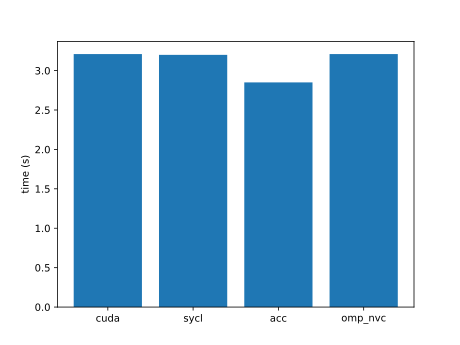 |
| che | 3.62 | 3.05 | 3.27 | 3.38 | A | 1.1 |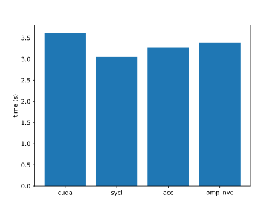 |
| chi2 | 197.09 | 217.04 | 220.78 | 251.54 | A | 51.0 | |
| clenergy | 2.68 | 2.66 | 3.13 | 3.16 | A | 0.6 |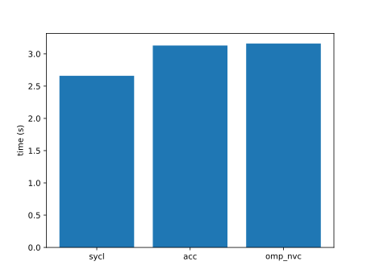 |
| clink | 4.98 | 56.20 | 8.31 | 8.15 | A | 1.8 |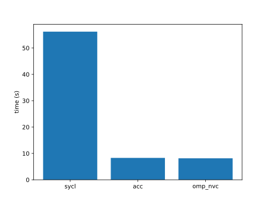 |
| cmp | exe err | exe err | build err | exe err | A | |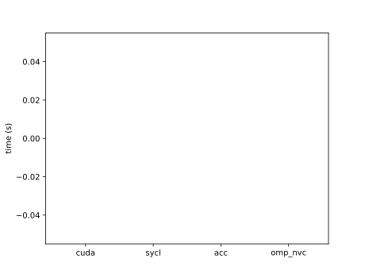 |
| cm | exe err | exe err | build err | exe err | B | | |
| cobahh | 487.96 | 406.65 | 383.64 | 388.03 | A | 55.9 |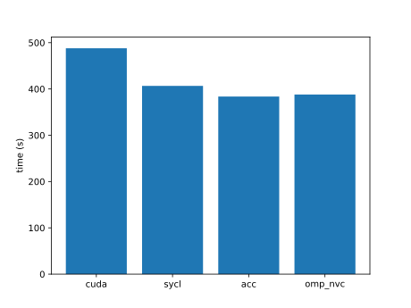 |
| colorwheel | 39.48 | 37.38 | 27.55 | 27.96 | A | 2.3 |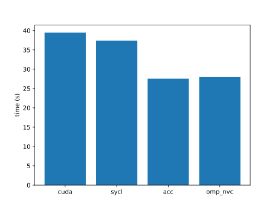 |
| columnarSolver | 9.83 | 10.16 | 16.87 | 10.22 | B | 1.6 | |
| complex | 23.04 | 22.28 | 12.59 | 12.96 | A | 0.7 | |
| compute-score | 3.28 | 3.24 | 3.27 | 4.34 | B | 1.2 | |
| concat | 17.45 | 15.08 | 16.24 | 15.73 | A | 4.7 | |
| contract | 9.28 | 11.40 | 28.95 | 10.82 | A | 0.9 | |
| conversion | 5.09 | 4.98 | 3.56 | 3.44 | A | 16.6 | |
| convolution1D | 382.64 | 380.96 | 333.42 | 383.27 | B | 16.7 | |
| convolution3D | 2.55 | 2.48 | 3.17 | 2.51 | A | 0.6 | |
| convolutionSeparable | 13.37 | 13.58 | build err | 22.05 | B | 3.6 | |
| cooling | 381.03 | 154.60 | 452.57 | 454.09 | A | 14.3 | |
| crc64 | 56.48 | 58.47 | 57.16 | 57.25 | A | 1.9 | |
| cross | 12.82 | 14.58 | 7.67 | 8.04 | A | 6.1 | |
| crs | 25.43 | 24.78 | build err | over 600 | B | 0.6 | |
| d2q9-bgk | 2.59 | 2.85 | build err | 4.37 | B | 0.9 | |
| damage | 29.66 | 24.45 | 36.68 | 243.28 | B | 8.7 | |
| dct8x8 | 85.64 | 130.74 | build err | build err | B | 32.8 | |
| ddbp | 16.32 | 17.41 | build err | 17.27 | B | 3.9 | |
| debayer | 6.75 | 6.37 | 6.68 | 6.79 | B | 2.7 | |
| degrid | 14.49 | 14.97 | 23.24 | 17.04 | A | 1.7 | |
| dense-embedding | 112.61 | 142.22 | 99.47 | 184.08 | B | 14.6 | |
| depixel | 105.99 | 157.40 | 208.93 | 168.04 | A | 8.2 | |
| deredundancy | 16.29 | 17.89 | 15.82 | 15.76 | B | 3.5 | |
| diamond | 36.76 | build err | build err | 37.30 | A | 0.7 | |
| distort | 2.52 | 2.45 | 2.45 | 2.50 | A | 0.6 | |
| divergence | 4.74 | 5.32 | 3.15 | 3.15 | A | 0.6 | |
| doh | 14.61 | 14.97 | 2.39 | 2.41 | A | 0.6 | |
| dp | 53.24 | build err | 25.04 | 25.25 | A | 49.5 | |
| dslash | 2.68 | 2.70 | 2.68 | 2.66 | A | 1.9 | |
| dxtc2 | 2.49 | 2.49 | build err | over 600 | B | 0.6 | |
| easyWave | 3.09 | 2.97 | 2.79 | 3.08 | A | 0.8 | |
| ecdh | 14.96 | 11.26 | 18.09 | 19.13 | A | 4.4 | |
| eigenvalue | 21.76 | 19.92 | over 600 | 22.02 | A | 0.6 | |
| entropy | 48.31 | 47.60 | 94.05 | 49.43 | B | 2.5 | |
| epistasis | 54.59 | 53.82 | 259.15 | 110.41 | A | 4.3 | |
| expdist | 7.57 | 7.45 | build err | 12.43 | B | 0.6 | |
| extend2 | 5.80 | 5.17 | 4.68 | 4.94 | A | 0.6 | |
| extrema | 7.05 | 6.75 | 6.99 | 7.10 | A | 0.6 | |
| face | 2.72 | 2.64 | 2.45 | exe err | A | 0.6 | |
| fdtd3d | 30.14 | 31.50 | build err | 43.29 | B | 1.0 | |
| feynman-kac | 81.22 | 41.84 | 48.24 | 22.16 | A | 0.6 | |
| fft | 3.17 | 3.19 | build err | 3.19 | B | 0.8 | |
| fhd | over 600 | 183.93 | over 600 | exe err | A | 2.5 | |
| filter | 168.70 | build err | build err | 154.77 | B | 11.3 | |
| flip | 10.43 | 37.32 | 14.45 | 15.50 | A | 26.9 | |
| floydwarshall | 74.91 | 73.45 | 72.59 | 83.41 | A | 0.7 | |
| fluidSim | 19.45 | 17.67 | 17.30 | 17.36 | A | 0.6 | |
| fpc | 67.41 | 66.38 | build err | exe err | B | 2.6 | |
| fpdc | 4.82 | 5.37 | build err | over 600 | B | 2.1 | |
| fresnel | 6.64 | 6.00 | 6.61 | 6.61 | A | 1.8 | |
| frna | 103.73 | 104.63 | build err | build err | B | 3.9 | |
| fwt | 3.13 | 3.12 | 3.35 | 3.47 | B | 0.6 | |
| gabor | 21.34 | 21.57 | 21.27 | 57.42 | A | 9.7 | |
| gamma-correction | 68.53 | 63.44 | 105.30 | 104.46 | A | 1.1 | |
| ga | 48.84 | 36.53 | 32.72 | 33.46 | A | 0.6 | |
| gaussian | 15.65 | 4.12 | 3.96 | 4.07 | A | 0.7 | |
| gc | 2.59 | 2.41 | build err | build err | A | 0.6 | |
| gd | 12.38 | 13.02 | 12.66 | 12.83 | A | 0.8 | |
| geglu | 27.67 | 94.40 | 22.13 | 22.07 | A | 8.2 | |
| geodesic | 2.54 | 2.60 | 2.51 | 2.52 | A | 0.8 | |
| glu | 59.42 | 121.58 | 124.43 | 120.93 | A | 15.8 | |
| gmm | 35.58 | 35.97 | build err | 37.28 | B | 1.5 | |
| goulash | 44.04 | 27.35 | 36.03 | 36.52 | A | 26.2 | |
| gpp | 5.15 | 4.29 | 4.10 | 4.15 | A | 2.7 | |
| grep | 55.53 | 29.24 | build err | 1.72 | B | 4.9 | |
| grrt | 14.22 | 14.54 | 13.31 | 12.82 | A | 0.6 | |
| haccmk | 4.70 | 4.33 | 2.57 | 4.42 | A | 0.6 | |
| hausdorff | 30.92 | 30.37 | 32.21 | 31.92 | A | 0.6 | |
| haversine | 2.22 | 2.18 | 2.49 | 2.43 | A | 1.0 | |
| heartwall | 7.48 | exe err | build err | build err | A | 2.7 | |
| heat2d | 6.14 | 61.50 | 25.22 | 5.92 | A | 0.8 | |
| heat | 22.95 | 22.04 | 15.34 | 16.22 | B | 16.9 | |
| hellinger | 4.94 | 4.80 | 6.88 | 4.52 | A | 0.6 | |
| henry | 3.91 | 3.77 | 2.86 | 2.74 | A | 0.6 | |
| hexciton | 4.19 | 6.03 | build err | 4.96 | B | 0.6 | |
| histogram | 3.06 | 2.98 | build err | 3.30 | B | 0.6 | |
| hmm | 4.22 | 8.56 | 14.71 | 2.81 | A | 0.7 | |
| hogbom | 0.53 | 2.67 | 2.65 | 2.76 | B | 0.7 | |
| hotspot3D | 18.45 | 16.21 | 18.11 | 18.00 | A | 0.6 | |
| hwt1d | 3.15 | 3.13 | 3.27 | 3.23 | B | 0.6 | |
| hybridsort | 12.83 | 15.27 | build err | 12.96 | B | 1.2 | |
| hypterm | 5.75 | 5.86 | 13.14 | 13.12 | A | 3.5 | |
| idivide | 6.12 | 8.31 | 8.02 | 9.39 | A | 0.6 | |
| interleave | 4.15 | 4.13 | 4.07 | 3.44 | A | 0.6 | |
| interval | 7.59 | 7.15 | 13.47 | 10.78 | A | 1.0 | |
| inversek2j | 2.84 | 1.05 | 225.58 | 111.49 | A | 0.6 | |
| ising | 10.77 | 258.64 | 13.36 | 13.31 | A | 2.4 | |
| iso2dfd | 17.76 | 17.67 | 13.97 | 14.20 | A | 49.7 | |
| jacobi | 2.80 | 2.77 | 3.56 | 3.50 | A | 0.6 | |
| jenkins-hash | 5.05 | 4.98 | 5.14 | 5.17 | A | 10.0 | |
| kalman | 335.35 | over 600 | build err | exe err | A | 10.8 | |
| keccaktreehash | 7.76 | 8.26 | 11.46 | 10.08 | A | 0.7 | |
| keogh | 22.46 | 7.03 | 5.80 | 5.89 | A | 0.9 | |
| kernelLaunch | 13.80 | 14.84 | 281.99 | 73.99 | B | 0.6 | |
| kmeans | 28.57 | 28.93 | 27.05 | 22.68 | B | 0.7 | |
| knn | 4.43 | 4.48 | 4.28 | 4.53 | B | 0.6 | |
| lanczos | 2.61 | 2.61 | build err | 2.81 | B | 0.6 | |
| langevin | 21.81 | 17.73 | 6.26 | 31.31 | A | 31.1 | |
| langford | 2.76 | 2.54 | build err | build err | B | 2.1 | |
| laplace3d | 65.95 | 64.92 | 14.60 | 14.64 | A | 8.8 | |
| laplace | 10.89 | 333.46 | 11.93 | 11.34 | A | 0.6 | |
| lavaMD | 104.27 | 102.55 | build err | 116.55 | B | 49.9 | |
| layout | 3.28 | 3.27 | 2.66 | 2.93 | A | 0.6 | |
| lci | 17.78 | 10.00 | 4.36 | 4.36 | A | 0.6 | |
| lda | 3.10 | 3.10 | build err | build err | B | 0.6 | |
| ldpc | 4.83 | 4.91 | build err | 9.60 | B | 0.6 | |
| lebesgue | 39.25 | 41.65 | 39.43 | 39.11 | A | 1.0 | |
| leukocyte | 0.64 | build err | build err | 0.92 | A | 0.6 | |
| libor | 2.87 | 2.87 | 13.25 | 2.84 | A | 4.0 | |
| lid-driven-cavity | 10.21 | 10.91 | build err | 22.40 | B | 0.6 | |
| lif | 100.17 | 116.49 | 125.87 | 124.42 | A | 31.9 | |
| linearprobing | 105.14 | 102.65 | build err | build err | A | 1.4 | |
| log2 | 2.80 | 0.74 | 2.77 | 2.81 | A | 1.3 | |
| lombscargle | 3.14 | 2.99 | 3.06 | 3.05 | A | 0.6 | |
| loopback | 5.73 | 5.33 | 5.38 | 8.16 | B | 0.6 | |
| lrn | 104.40 | 105.73 | 111.48 | 78.63 | A | 22.5 | |
| lr | 6.18 | 6.36 | build err | build err | B | 0.6 | |
| lsqt | 19.97 | 19.99 | 32.63 | 32.86 | A | 1.7 | |
| lud | 5.54 | 8.19 | 9.54 | 46.07 | B | 4.7 | |
| lulesh | 7.81 | 11.28 | 11.70 | 8.41 | A | 54.2 | |
| mallocFree | 3.72 | 3.69 | 2.68 | 2.67 | A | 8.4 | |
| mandelbrot | 5.75 | 5.29 | 3.75 | 3.82 | A | 0.6 | |
| mask | 22.03 | 55.31 | 21.60 | 29.68 | A | 8.8 | |
| match | 40.66 | 42.51 | build err | 41.46 | B | 0.6 | |
| matern | 6.11 | 6.24 | 3.85 | 31.37 | B | 0.7 | |
| matrix-rotate | 32.32 | 35.98 | 35.18 | 35.00 | A | 8.6 | |
| maxFlops | 25.53 | 25.56 | 26.46 | 25.46 | A | 0.6 | |
| maxpool3d | 32.54 | 33.75 | 32.80 | 32.24 | A | 10.2 | |
| mcmd | 12.38 | 9.03 | 10.79 | 11.06 | A | 0.6 | |
| mcpr | 25.42 | 14.07 | 21.86 | 15.00 | B | 0.6 | |
| md5hash | 15.45 | 15.14 | 15.35 | 15.50 | A | 0.6 | |
| mdh | 2.80 | 48.13 | 35.15 | 2.67 | A | 0.6 | |
| md | 14.56 | 14.68 | 14.24 | 14.22 | A | 0.6 | |
| meanshift | 3.76 | 4.42 | 4.71 | 4.40 | B | 0.6 | |
| medianfilter | 3.54 | 3.75 | build err | 4.68 | B | 0.6 | |
| memcpy | 5.61 | 3.54 | 6.52 | 6.54 | A | 0.6 | |
| memtest | 18.43 | 18.85 | 19.78 | 19.45 | A | 2.6 | |
| merge | 432.85 | 442.02 | build err | 425.74 | B | 9.7 | |
| metropolis | 12.73 | 14.03 | build err | 65.32 | B | 17.2 | |
| michalewicz | 43.63 | 150.55 | over 600 | 63.30 | A | 50.2 | |
| minibude | 2.89 | 3.31 | build err | 3.54 | B | 0.6 | |
| miniFE | | | | -- | A | | |
| minimap2 | 1.51 | 2.32 | | 2.19 | A | 1.0 | |
| minisweep | 50.83 | 56.83 | 35.43 | 35.90 | A | 7.7 | |
| miniWeather | 8.49 | 8.19 | 33.30 | 33.14 | A | 0.6 | |
| minkowski | 23.94 | 24.25 | 22.27 | 22.36 | A | 0.6 | |
| mis | 24.24 | 13.22 | build err | 2.60 | B | 0.6 | |
| mixbench | 3.77 | 3.62 | build err | 3.80 | B | 0.6 | |
| morphology | 5.03 | 4.81 | build err | over 600 | B | 4.4 | |
| mrc | 21.72 | 83.40 | 17.88 | 17.83 | A | 23.5 | |
| mriQ | 4.76 | 5.31 | 5.04 | 5.21 | A | 0.6 | |
| mr | 3.31 | 3.33 | build err | 3.31 | A | 0.6 | |
| mt | 5.66 | 4.65 | 4.29 | 4.08 | A | 0.7 | |
| multimaterial | 28.40 | 14.67 | 12.11 | 21.91 | B | 3.1 | |
| murmurhash3 | 2.78 | 2.80 | 2.67 | 2.69 | A | 2.6 | |
| myocyte | 33.92 | 3.03 | build err | exe err | A | 0.6 | |
| nbody | 23.95 | 25.24 | 19.63 | 19.61 | A | 0.6 | |
| ne | 4.83 | 5.37 | 4.90 | 4.94 | A | 3.2 | |
| nlll | 3.07 | 3.08 | build err | 3.06 | B | 0.6 | |
| nms | 2.60 | 2.59 | build err | 2.73 | B | 0.6 | |
| nn | 2.55 | 2.47 | 2.56 | 2.52 | A | 0.6 | |
| norm2 | 3.77 | build err | 3.71 | 4.97 | A | 2.7 | |
| nqueen | 6.31 | 6.94 | 23.85 | 6.87 | A | 0.6 | |
| ntt | 6.21 | 6.63 | build err | 6.65 | B | 0.6 | |
| nw | 16.68 | 26.82 | build err | 33.48 | B | 15.3 | |
| openmp | 13.88 | 81.27 | build err | 13.65 | B | 0.7 | |
| overlay | 5.87 | 5.33 | 9.20 | 10.50 | A | 0.6 | |
| p4 | 3.78 | 3.77 | build err | 16.94 | B | 0.6 | |
| page-rank | 50.87 | 375.35 | 46.20 | 46.72 | A | 12.8 | |
| particle-diffusion | 11.92 | 11.94 | 13.04 | 12.23 | A | 3.3 | |
| particlefilter | 222.50 | 198.39 | build err | 219.65 | B | 4.2 | |
| particles | 3.67 | 3.46 | build err | over 600 | B | 0.6 | |
| pathfinder | 63.24 | 64.27 | build err | exe err | B | 6.7 | |
| permutate | 26.61 | 24.87 | build err | 25.87 | B | 2.9 | |
| permute | 61.55 | 61.55 | 85.77 | 85.40 | A | 9.8 | |
| perplexity | 186.41 | 192.24 | 97.16 | 96.53 | A | 15.8 | |
| phmm | 3.72 | 3.53 | build err | 7.57 | B | 0.6 | |
| pnpoly | 7.07 | 21.12 | build err | 74.17 | A | 0.9 | |
| pns | 5.50 | 5.44 | build err | exe err | B | 1.3 | |
| pointwise | 21.34 | 21.28 | 53.08 | 75.86 | A | 15.8 | |
| pool | 27.23 | 51.58 | 41.75 | 41.00 | A | 8.2 | |
| popcount | 241.58 | 178.30 | 279.36 | 134.99 | A | 23.4 | |
| present | 2.87 | 2.67 | 3.04 | 3.05 | A | 0.6 | |
| prna | 79.29 | build err | build err | exe err | B | 4.8 | |
| projectile | 2.66 | 0.91 | 2.66 | 2.55 | A | 0.9 | |
| pso | 2.93 | 2.83 | build err | 2.69 | A | 0.6 | |
| qrg | 7.23 | 6.30 | 8.57 | 10.24 | A | 0.6 | |
| qtclustering | 35.55 | 34.48 | build err | exe err | B | 0.8 | |
| quantBnB | 18.55 | 121.16 | 125.38 | 125.68 | A | 2.9 | |
| quicksort | 36.33 | 36.99 | build err | 33.98 | B | 0.8 | |
| radixsort | 2.94 | 2.90 | build err | 8.11 | B | 0.6 | |
| rainflow | 29.26 | 29.99 | 29.64 | 29.52 | A | 49.0 | |
| randomAccess | 6.66 | 6.90 | build err | 24.54 | A | 1.1 | |
| reaction | 4.18 | 4.08 | build err | 9.17 | B | 0.6 | |
| recursiveGaussian | 4.03 | 4.04 | build err | 4.27 | B | 0.6 | |
| resize | 6.38 | 5.98 | 6.03 | 6.01 | A | 4.7 | |
| reverse | 3.47 | 3.67 | build err | 8.08 | B | 0.6 | |
| rfs | 46.68 | 46.70 | 48.57 | 48.26 | A | 6.3 | |
| rng-wallace | 2.62 | 2.56 | build err | 3.55 | B | 0.8 | |
| rodrigues | 96.39 | 101.46 | 114.74 | 101.38 | A | 54.0 | |
| romberg | 2.75 | 2.72 | build err | 2.81 | B | 0.6 | |
| rsbench | 3.01 | 3.39 | build err | build err | B | 0.6 | |
| rsc | 2.75 | 0.50 | build err | 2.73 | B | 0.6 | |
| rtm8 | 4.35 | 17.67 | 15.76 | 4.22 | A | 1.5 | |
| rushlarsen | 140.36 | 129.52 | 135.46 | 135.06 | A | 6.0 | |
| s3d | 2.92 | 2.94 | build err | 2.90 | A | 0.9 | |
| s8n | 2.58 | 2.49 | 2.47 | 2.43 | A | 0.6 | |
| sad | 2.40 | 2.48 | 2.63 | 81.81 | A | 0.6 | |
| sampling | 5.85 | 5.77 | build err | 5.65 | B | 0.7 | |
| scan2 | 2.93 | 2.91 | build err | 6.76 | B | 0.8 | |
| scan | 33.88 | 31.87 | build err | 33.05 | B | 1.3 | |
| scatterAdd | 7.95 | 8.10 | 8.05 | 7.79 | A | 8.0 | |
| scel | 17.04 | 322.81 | 11.91 | 11.29 | A | 3.6 | |
| secp256k1 | 2.77 | 2.68 | 2.79 | 2.69 | A | 0.6 | |
| sheath | 5.92 | 5.85 | 5.81 | 5.82 | A | 0.6 | |
| shmembench | 5.25 | 9.16 | build err | exe err | B | 0.6 | |
| simplemoc | 233.38 | 400.17 | 293.35 | 294.34 | B | 15.4 | |
| simpleSpmv | 317.74 | 319.81 | 320.00 | 317.47 | A | 7.0 | |
| slu | build err | build err | build err | build err | B | | |
| snake | 8.17 | 8.43 | 10.57 | 10.42 | A | 0.6 | |
| sobel | 2.81 | 2.89 | 3.18 | 3.32 | A | 0.6 | |
| sobol | 4.71 | 3.89 | build err | 4.51 | B | 4.4 | |
| softmax-online | 11.10 | 13.69 | build err | 15.10 | B | 3.7 | |
| softmax | 44.19 | 39.36 | 40.91 | 36.96 | A | 25.9 | |
| sort | 4.69 | build err | build err | 36.92 | B | 0.8 | |
| sosfil | 4.65 | 4.75 | build err | 13.32 | B | 0.6 | |
| sph | 5.45 | 5.41 | 22.53 | 5.40 | A | 0.6 | |
| split | 35.89 | 35.78 | build err | 37.73 | B | 15.8 | |
| spm | 100.86 | 104.39 | 98.00 | 98.41 | A | 10.6 | |
| sptrsv | 2.44 | 2.70 | build err | 2.81 | B | 0.6 | |
| srad | 36.80 | 37.49 | build err | exe err | B | 14.7 | |
| ss | 7.45 | 7.23 | 9.95 | 18.10 | B | 0.6 | |
| stddev | 48.33 | 46.55 | build err | 51.00 | B | 8.7 | |
| stencil1d | 3.75 | 4.68 | 30.81 | 35.77 | A | 4.7 | |
| stencil3d | 4.01 | 4.35 | build err | 4.24 | B | 11.8 | |
| streamcluster | 5.89 | 11.84 | build err | 26.24 | B | 0.7 | |
| su3 | 2.99 | 5.17 | 7.47 | 7.48 | A | 2.5 | |
| surfel | 13.03 | 510.01 | 12.02 | 11.97 | A | 0.6 | |
| svd3x3 | 1.91 | 2.00 | 2.86 | 2.89 | A | 0.7 | |
| sw4ck | 3.58 | 6.40 | 29.28 | 28.11 | A | 1.9 | |
| swish | 7.49 | 24.54 | 5.48 | 5.39 | A | 8.2 | |
| tensorT | 2.73 | 2.56 | build err | 2.87 | B | 3.6 | |
| testSNAP | 3.69 | 3.73 | 66.16 | 4.19 | A | 3.2 | |
| thomas | 125.54 | 131.17 | 59.68 | 49.73 | A | 51.8 | |
| threadfence | 25.80 | 26.09 | build err | 35.11 | B | 6.0 | |
| tissue | 11.96 | 12.45 | 11.82 | 18.23 | A | 0.6 | |
| tonemapping | 3.24 | 3.15 | 3.02 | 2.95 | A | 0.6 | |
| tqs | 2.71 | 2.57 | build err | 2.59 | B | 0.6 | |
| triad | 2.72 | 2.62 | 2.82 | 2.75 | A | 0.7 | |
| tridiagonal | 8.42 | 8.80 | build err | 24.55 | B | 4.0 | |
| tsa | 54.11 | 36.86 | build err | 29.09 | B | 20.6 | |
| tsp | 5.10 | 7.82 | build err | build err | B | 0.6 | |
| urng | 2.47 | 2.43 | 2.21 | 2.20 | B | 0.6 | |
| vanGenuchten | 21.39 | 21.48 | 30.99 | 30.92 | A | 6.2 | |
| vmc | 5.07 | 4.38 | build err | build err | B | 0.6 | |
| vol2col | 8.27 | 5.26 | 7.87 | 8.13 | A | 3.5 | |
| wedford | exe err | build err | build err | exe err | B | | |
| winograd | 0.84 | 0.65 | 3.25 | 3.20 | A | 0.6 | |
| wlcpow | 4.53 | 4.50 | build err | 12.37 | B | 0.7 | |
| wordcount | 8.03 | 7.98 | 8.18 | 7.93 | A | 0.8 | |
| wsm5 | 5.57 | 4.78 | 5.59 | 5.73 | B | 0.6 | |
| wyllie | 107.36 | 112.64 | 108.06 | over 600 | B | 1.3 | |
| xlqc | build err | build err | build err | build err | B | | |
| xsbench | 46.19 | 37.40 | 37.18 | 3.89 | A | 6.3 | |
| zeropoint | 18.63 | 55.54 | 21.82 | 24.23 | A | 15.8 | |
| zmddft | 2.63 | 2.63 | build err | 14.28 | B | 1.6 | |
| | | | | | | |
| 完了した件数 | 318 | 306 | 214 (A:178) | 285 | | | |

sycl と acc がともに完了した件数 211 (A:175)

分類: OpenMP コードが omp_get_* を (A) 含まない (B) 含む
